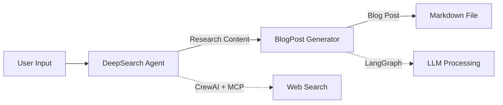

# ACP to A2A Migration - Complete Implementation Guide

This repository demonstrates the complete migration from **ACP (Agent Communication Protocol)** to **A2A (Agent-to-Agent Protocol)** using the BeeAI Server framework.

## 🎯 Migration Overview

This project showcases a working multi-agent system that has been fully migrated from ACP to A2A protocol:

- **DeepSearch Agent**: Research agent using CrewAI framework
- **BlogPost Generator Agent**: Content generation agent using LangGraph workflow
- **Agentic Client**: Client application that orchestrates agent communication

## 📋 Key Migration Changes

### 1. **Server Framework**
- ❌ **OLD (ACP)**: FastAPI with custom route handlers
- ✅ **NEW (A2A)**: BeeAI Server with `@server.agent` decorator

### 2. **Dependencies**
- ❌ **OLD (ACP)**: `acp-sdk`, `fastapi`, manual middleware
- ✅ **NEW (A2A)**: `beeai-sdk>=0.3.0`, `a2a>=0.1.0`, automatic protocol handling

### 3. **Endpoints**
- ❌ **OLD (ACP)**: `/a2a/tasks/send`, `/a2a/tasks/sendSubscribe`, manual JSON-RPC
- ✅ **NEW (A2A)**: `/v1/message:stream`, automatic protocol handling

### 4. **Message Structure**
- ❌ **OLD (ACP)**: Custom Message classes, manual dictionary access
- ✅ **NEW (A2A)**: `a2a.types.Message`, structured `message.parts` extraction

### 5. **Response Pattern**
- ❌ **OLD (ACP)**: `return JSONResponse({"result": ...})`
- ✅ **NEW (A2A)**: `yield result` (automatic streaming)

### 6. **Task Management**
- ❌ **OLD (ACP)**: Manual task storage, status tracking, session management
- ✅ **NEW (A2A)**: Platform-managed context, automatic task handling

## 🚀 Quick Start

### Prerequisites

```bash
# Python 3.12+
python --version

# Install dependencies
pip install -r requirements.txt
```

### Environment Setup

Create a `.env` file with your API keys:

```env
GROQ_API_KEY=your_groq_api_key_here
LINKUP_API_KEY=your_linkup_api_key_here  # Optional for DeepSearch
```

### Running the System

#### Option 1: Using Main Launcher

```bash
# Terminal 1: Start Research Agent
python main.py server-research

# Terminal 2: Start Blog Generator Agent
python main.py server-blog

# Terminal 3: Run Client Workflow
python main.py client
```

#### Option 2: Direct Execution

```bash
# Terminal 1: Start Research Agent
python deepserach_server_a2a.py

# Terminal 2: Start Blog Generator Agent
python blogpost_server_a2a.py

# Terminal 3: Run Client
python agentic_client_a2a.py sequential
```

## 📁 Project Structure

```
ACP_Migration_A2A/
├── blogpost_server_a2a.py      # BlogPost Generator Agent (LangGraph)
├── deepserach_server_a2a.py    # DeepSearch Research Agent (CrewAI)
├── agentic_client_a2a.py       # Client orchestrator
├── main.py                     # Launcher script
├── requirements.txt            # Python dependencies
├── pyproject.toml             # Project configuration
├── README.md                  # This file
└── .env                       # Environment variables (create this)
```

## 🔄 Migration Details

### File-by-File Changes

#### 1. `blogpost_server_a2a.py` (LangGraph Agent)

**Major Changes:**
```python
# OLD (ACP)
from fastapi import FastAPI
app = FastAPI()

@app.post("/v1/generate-blog")
async def generate_blog(request: dict):
    result = process(request["message"])
    return {"result": result}

# NEW (A2A)
from beeai_sdk.server import Server
from a2a.types import Message

server = Server()

@server.agent(name="blogpost_generator_agent")
async def blogpost_generator_agent(
    message: Message,
    context: RunContext,
) -> AsyncGenerator[str, None]:
    content = extract_query_from_message(message)
    result = process(content)
    yield result
```

**Key Features:**
- ✅ LangGraph workflow for blog generation
- ✅ Streaming JSON parser for agent-to-agent communication
- ✅ Automatic message extraction from A2A format
- ✅ Markdown file output with metadata

#### 2. `deepserach_server_a2a.py` (CrewAI Agent)

**Major Changes:**
```python
# OLD (ACP)
from fastapi import FastAPI
app = FastAPI()

@app.post("/v1/research")
async def research(request: dict):
    query = request.get("query")
    crew = Crew(agents=[research_agent], tasks=[task])
    result = crew.kickoff()
    return {"result": result.raw}

# NEW (A2A)
from beeai_sdk.server import Server
from a2a.types import Message

server = Server()

@server.agent(name="deepsearch_agent_handler")
async def deepsearch_agent_handler(
    message: Message,
    context: RunContext,
) -> AsyncGenerator[str, None]:
    query = extract_query_from_message(message)
    crew = Crew(agents=[research_agent], tasks=[task])
    result = crew.kickoff()
    yield result.raw
```

**Key Features:**
- ✅ CrewAI framework integration
- ✅ MCP (Model Context Protocol) tools support
- ✅ Groq LLM integration
- ✅ Comprehensive research capabilities

#### 3. `agentic_client_a2a.py` (Client)

**Major Changes:**
```python
# OLD (ACP)
async def invoke_agent(url, task_id, message):
    payload = {
        "jsonrpc": "2.0",
        "method": "tasks/sendSubscribe",
        "params": {"id": task_id, "message": message}
    }
    response = await client.post(f"{url}/a2a/tasks/sendSubscribe", json=payload)

# NEW (A2A)
async def invoke_agent(url, text_input):
    payload = {
        "message": {
            "content": [{"text": text_input}]
        }
    }
    response = await client.post(f"{url}/v1/message:stream", json=payload)
```

**Key Features:**
- ✅ Simplified message format (no JSON-RPC wrapper)
- ✅ Automatic streaming response parsing
- ✅ Multi-agent workflow orchestration
- ✅ Agent discovery via `.well-known/agent.json`

## 🔑 Critical Migration Fixes

### 1. Message Extraction

**Problem (ACP):** Direct dictionary access
```python
# OLD
query = request.get("message", "")
```

**Solution (A2A):** Structured extraction from message.parts
```python
# NEW
def extract_query_from_message(message: Message) -> str:
    query = ""
    for part in getattr(message, "parts", []):
        root = getattr(part, "root", None)
        if root and getattr(root, "kind", None) == "text":
            query += (root.text or "")
    return query.strip()
```

### 2. Streaming JSON Parser

**Problem:** Agent-to-agent communication passes raw JSON instead of extracted text

**Solution:** Parse statusUpdate JSON objects
```python
def parse_streaming_json(research_content: str) -> str:
    if "statusUpdate" not in research_content:
        return research_content
    
    parsed_chunks = []
    json_objects = research_content.replace("}{", "}|||{").split("|||")
    
    for json_str in json_objects:
        data = json.loads(json_str)
        if "statusUpdate" in data:
            status = data["statusUpdate"].get("status", {})
            msg = status.get("message", {})
            for part in msg.get("content", []):
                if isinstance(part, dict) and "text" in part:
                    parsed_chunks.append(str(part["text"]))
    
    return "".join(parsed_chunks).strip()
```

### 3. LLM Invocation

**For ChatModel (like ChatGroq):**
```python
# Correct: Use message list
response = llm.invoke([{"role": "user", "content": prompt}])
```

**For LangChain.LLM base class:**
```python
# Correct: Use string prompt
response = llm.invoke(prompt)
```

## 🧪 Testing

### Test Individual Agents

```bash
# Test DeepSearch Agent
python agentic_client_a2a.py deepsearch

# Test BlogPost Generator Agent
python agentic_client_a2a.py blogpost
```

### Test Full Workflow

```bash
# Sequential workflow (recommended)
python agentic_client_a2a.py sequential

# Streaming workflow
python agentic_client_a2a.py streaming
```

## 📊 Workflow



**Flow:**
1. User provides a topic
2. DeepSearch Agent researches the topic using CrewAI + MCP tools
3. Research content is passed to BlogPost Generator
4. BlogPost Generator creates a blog post using LangGraph workflow
5. Final blog post is saved as a markdown file

## 🛠️ Development

### Adding Comments

All Python files include comprehensive migration comments:
- `A2A MIGRATION:` - Marks migrated code sections
- `A2A MIGRATION NOTE:` - Explains migration decisions
- `A2A MIGRATION CRITICAL FIX:` - Highlights critical fixes
- `OLD (ACP):` - Shows old implementation
- `NEW (A2A):` - Shows new implementation

### Code Style

```python
# A2A MIGRATION: Section header
# OLD (ACP): old_code_pattern
# NEW (A2A): new_code_pattern

def function_name():
    """
    Function description
    
    A2A MIGRATION NOTE: Explanation of changes
    """
    # Implementation
```

## 📚 References

- [ACP to A2A Migration Guide (Complete)](C:\Users\PLNAYAK\Documents\ACP_A2A\ACP-to-A2A-Complete-Migration-Guide-With-Code.md)
- [A2A Migration Guide (MDX)](acp-a2a-migration-guide.mdx)
- [BeeAI SDK Documentation](https://github.com/i-am-bee/beeai-platform)
- [A2A Protocol Specification](https://github.com/google/a2a)

## 🔧 Troubleshooting

### Common Issues

**1. Import Errors**
```bash
# Solution: Install dependencies
pip install -r requirements.txt
```

**2. API Key Errors**
```bash
# Solution: Create .env file with API keys
echo "GROQ_API_KEY=your_key_here" > .env
```

**3. Port Already in Use**
```bash
# Solution: Change ports in server files
# blogpost_server_a2a.py: Line ~445
server.run(host="0.0.0.0", port=8004)

# deepserach_server_a2a.py: Line ~247
server.run(host="0.0.0.0", port=8003)
```

**4. Agent Returns Generic Content**
```bash
# Cause: Streaming JSON not parsed correctly
# Solution: Ensure parse_streaming_json() is called in blogpost agent
```

## 🎓 Learning Points

### What Changed?

1. **Simplification**: A2A protocol is much simpler than custom JSON-RPC
2. **Automation**: BeeAI Server handles protocol details automatically
3. **Streaming**: Built-in streaming support via AsyncGenerator
4. **Context**: Platform-managed context instead of manual session tracking
5. **Discovery**: Automatic agent card generation

### What Stayed the Same?

1. **Agent Logic**: Business logic (CrewAI, LangGraph) unchanged
2. **LLM Integration**: LLM calls remain the same
3. **File Operations**: File I/O remains unchanged
4. **Error Handling**: Try/except patterns remain similar

## 📝 License

This is a demonstration project for educational purposes.

## 🤝 Contributing

This is a reference implementation. Feel free to use it as a template for your own ACP to A2A migrations.

## 📧 Support

For questions about the migration:
1. Review the comprehensive migration guide
2. Check inline comments in Python files
3. Test individual components using the test functions

---

**Migration Status**: ✅ Complete

**Last Updated**: 2025-01-19

**Version**: 2.0.0 (A2A)

